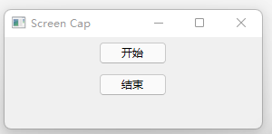

# screen-cap
录屏软件，基于python3开发。

## Issues
使用的时候遇到任何问题或有好的建议，请点击进入[issue](https://github.com/hai2007/screen-cap/issues)，欢迎参与维护！

## How to use?

首先需要安装必要的依赖：

```
python setup.py install
```

然后启动运行：

```
python ./src/main.py
```

运行成功以后，就可以看见下面弹框：



点击按钮 ``` [开始] ``` 就会开始录屏，点击 ``` [结束] ``` 按钮就会停止录屏。

录制的视频就是```./output.avi```文件，双击即可播放。

开源协议
---------------------------------------
[MIT](https://github.com/hai2007/screen-cap/blob/master/LICENSE)

Copyright (c) 2022 [hai2007](https://hai2007.github.io/SweetHome/) 走一步，再走一步。
